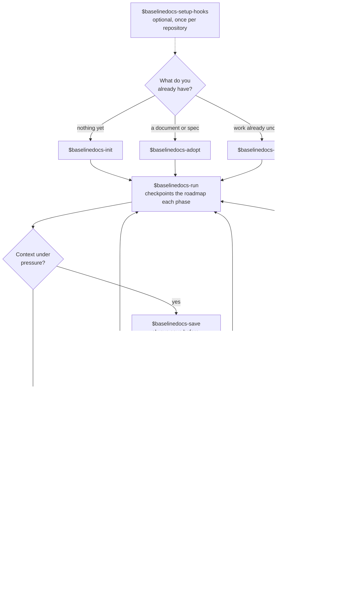

**Adaptive operational memory for agent-assisted software work.**

Baseline Docs stores current implementation truth, decisions, evidence, dependencies, and the exact continuation point so another conversation or agent can resume without relying on chat history.

## Install

```bash
npx skills add https://github.com/the-khiem7/Baselinedocs-Skills.git
```

From a local clone, replace the repository URL with `.`. To see what the install contains first, add `--list`.

Install the family, not individual skills. The skills hand off to each other by name: `baselinedocs-onboard` names `baselinedocs-sync-reconcile` for a contradiction it must not repair itself, and `baselinedocs-brief` names `baselinedocs-save` for a delta it must not write itself. A pointer to a skill that was never installed is a dead end the agent reaches only after the user has already asked for something.

## Workflow



`baselinedocs-save` before the branch is the step the rest rests on. Both branches lose the thread, A keeping a lossy summary and B keeping none, so the pack is the only thing that survives either.

| Branch             | Sources of truth afterwards                                       | Choose it when                                                                                       |
| ------------------ | ----------------------------------------------------------------- | ---------------------------------------------------------------------------------------------------- |
| Stay in the thread | two: the pack, and a compaction summary that can disagree with it | the thread still holds something unwritable, a half-formed approach or a debugging session in flight |
| New thread         | one: the pack                                                     | the pack is current, which after a save it is                                                        |

| Trap                               | What is actually true                                                                                                                                                                                                 |
| ---------------------------------- | --------------------------------------------------------------------------------------------------------------------------------------------------------------------------------------------------------------------- |
| `brief` recovers detail          | It is a diagnostic, not a restore. It reads frontmatter and the active roadmap sections, and says so. It reports where work stands and whether the pack fell behind;`onboard` is what reads every document in full. |
| `save` is the step after `run` | `run` already checkpoints the roadmap each phase. `save` owns what a phase checkpoint does not: decisions closed, questions opened, scope moved.                                                                  |
| one thing is called compact        | Two are. Host`/compact` shrinks the conversation. `baselinedocs-maintain-compact` shrinks the pack, on a different axis: not a full window, but a pack gone noisy over months.                                    |

## Six User Entrypoints

| User intent                            | Skill                    | Outcome                                                   |
| -------------------------------------- | ------------------------ | --------------------------------------------------------- |
| Start durable docs with a new workflow | `baselinedocs-init`    | Create an adaptive pack or multi-pack initiative          |
| Adopt an existing source format        | `baselinedocs-adopt`   | Convert it into a complete, traceable baseline pack       |
| Capture work already in progress       | `baselinedocs-save`    | Save current brownfield context without restarting        |
| Execute an initialized roadmap         | `baselinedocs-run`     | Run phases with checkpoints and requested approval policy |
| Load an existing pack before working   | `baselinedocs-onboard` | Read the selected pack in full into working context       |
| Ask where the work stands mid-task     | `baselinedocs-brief`   | Report position cheaply, without loading the pack         |

All six set `policy.allow_implicit_invocation: false` for Codex, so they stay deliberate user actions. Three behaviors are worth knowing before you meet them:

- `onboard` writes nothing, and on a multi-pack initiative it routes before it loads: it reads the index, takes one domain pack rather than the whole set, and reports every point where a loaded document leaned on something that was not loaded.
- `run` invoked without both execution policies asks whether to pause after each phase and whether to commit each verified phase. It never chooses defaults silently.
- `setup-hooks` is a one-time per-repository administration utility, not part of the daily loop.

## Agent-Selected Skills

| Family    | Skills                                                                             |
| --------- | ---------------------------------------------------------------------------------- |
| Sync      | `sync-codebase`, `sync-decisions`, `sync-reconcile`       |
| Audit     | `audit-drift`, `audit-claims`                                                  |
| Maintain  | `maintain-compact`, `maintain-split` |
| Knowledge | `extract-wiki`                                                                   |

All skill IDs use lowercase kebab-case, for example `baselinedocs-sync-codebase`. These are agent-selected helpers: their UI names start with `Baseline Docs Internal:` and implicit invocation stays enabled. Some hosts do not enforce the Codex-specific policy, so each skill description states the classification too.

## Adaptive Pack Contract

Every pack has three core documents:

- `<prefix>.introduction.md`: scope, current truth, target, constraints
- `<prefix>.roadmap.md`: phases, dependencies, evidence, risks, next action
- `<prefix>.hallucination.md`: open questions and closed decisions

Two extensions are conditional:

- `<prefix>.sourcecode.md`: architecture and implementation flow
- `<prefix>.useguide.md`: consumer contract, API or method usage, migration procedure, or operator guidance

Do not create conditional files that would contain only filler. Existing five-file packs remain compatible; lifecycle skills preserve useful content and prune only when safe.

Each document carries frontmatter:

```yaml
---
baseline_schema: "2.0"
pack: "avatar-rollout"
document: "roadmap"
status: "active"
updated: "2026-07-30"
code_ref: "2d0bf83"
---
```

`updated` is the last document edit date. `code_ref` is the code state actually inspected. A newer commit is a drift signal, not proof by itself.

## Writing Policy

Baseline packs are current operational memory, not command transcripts.

- Record final verification evidence.
- Keep an intermediate failure only when it remains actionable, explains a design change, or reproduces a defect.
- Aggregate small post-initial corrections under the phase they refine.
- Create a new phase only for a distinct outcome, dependency, release gate, or independently reviewable scope.

## Wiki Boundary

Use `docs/wiki/<topic>.md` for reusable patterns such as migrations, conversions, integrations, and method usage.

- Baseline pack: task-specific state, decisions, evidence, roadmap.
- Wiki: task-independent instructions that can be injected into later work.

A pack is internal operational memory. Never reference a pack filename or section from inside code, configuration, or infrastructure resource descriptions. Those strings ship outside the repository, where an internal filename means nothing to the reader and can expose internal planning to anyone with access to the deployed resource.

`baselinedocs-extract-wiki` removes task chronology and links the reusable article back from the pack.

## Multi-Domain Work

Do not hide child packs behind a duplicated general pack. Keep every domain pack directly addressable and add an initiative index:

```text
docs/baseline/avatar-modernization/
  avatar-modernization.index.md
  identity-api/
    identity-api.introduction.md
    identity-api.roadmap.md
    identity-api.hallucination.md
  avatar-ui/
    avatar-ui.introduction.md
    avatar-ui.roadmap.md
    avatar-ui.hallucination.md
```

The index contains direct links, status, and dependency edges. It routes work without repeating child content.

## Phase Checkpoint Hooks

The repository includes a portable prompt-centric Stop hook for Codex, Claude Code, and Cursor. It creates one thread-local continuation and lets the agent decide whether the clearly identified pack in that thread needs a checkpoint. Python never searches globally for roadmaps or infers ownership from Git state.

Use `$baselinedocs-setup-hooks` to install or update it without copying files or replacing existing hook configuration. See [HOOKS.md](HOOKS.md) for behavior and manual fallback instructions. Hooks are a safety net; the roadmap workflow remains the source of truth.

## Compatibility

Each skill follows the Agent Skills folder shape:

```text
<skill>/
  SKILL.md
  agents/
    openai.yaml
  references/     # only when needed
```

The repository is compatible with Skills.sh discovery. Codex-specific invocation policy lives in `agents/openai.yaml`; other hosts can still use the portable `name` and `description` frontmatter.
