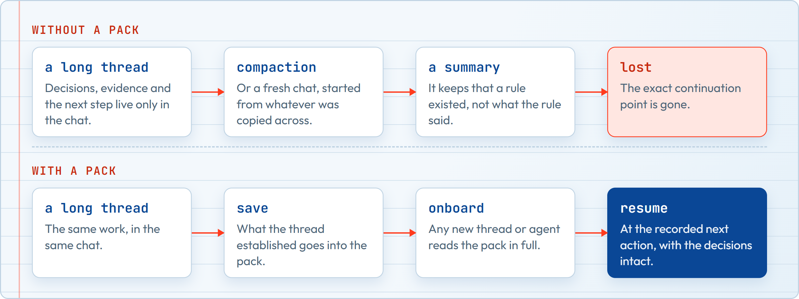
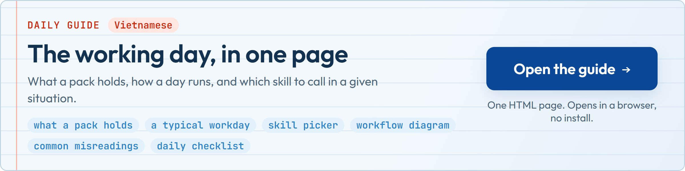
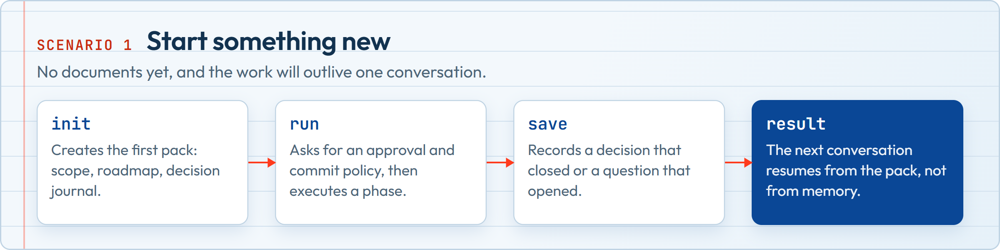
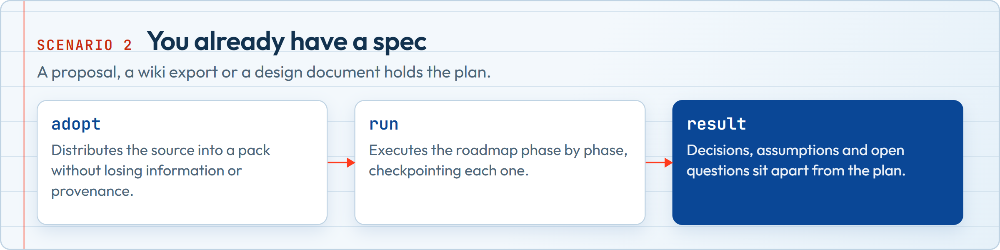
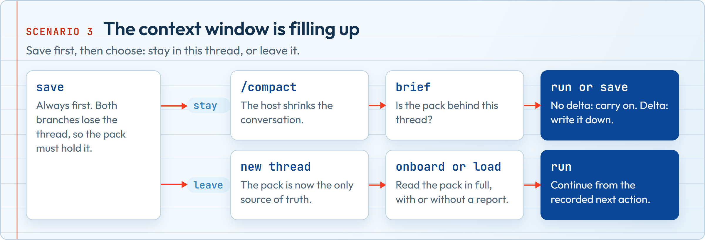
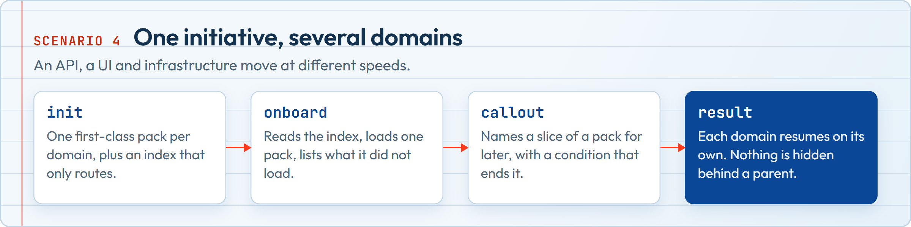
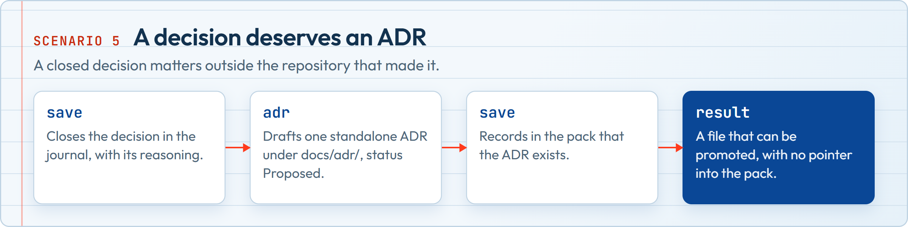
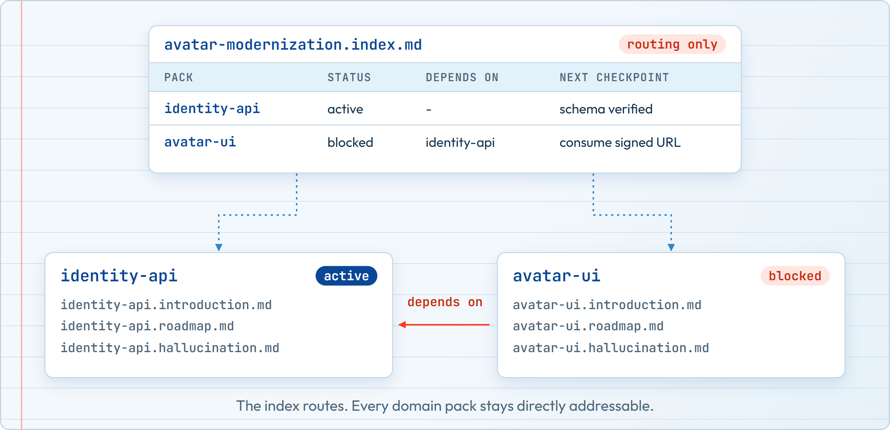

**Adaptive operational memory for agent-assisted software work.**

Baseline Docs stores current implementation truth, decisions, evidence, dependencies, and the exact continuation point so another conversation or agent can resume without relying on chat history.

<p align="center">
<a href="#install"><picture><source media="(prefers-color-scheme: dark)" srcset="assets/nav-install-dark.webp"></picture></a>
<a href="#workflow"><picture><source media="(prefers-color-scheme: dark)" srcset="assets/nav-workflow-dark.webp"></picture></a>
<a href="#scenarios"><picture><source media="(prefers-color-scheme: dark)" srcset="assets/nav-scenarios-dark.webp"></picture></a>
<a href="#skills"><picture><source media="(prefers-color-scheme: dark)" srcset="assets/nav-skills-dark.webp"></picture></a>
<a href="#adaptive-pack-contract"><picture><source media="(prefers-color-scheme: dark)" srcset="assets/nav-contract-dark.webp"></picture></a>
<a href="https://raw.githack.com/the-khiem7/Baselinedocs-Skills/main/docs/onboarding/baselinedocs-daily-workflow.html"><picture><source media="(prefers-color-scheme: dark)" srcset="assets/nav-guide-dark.webp"></picture></a>
</p>

## The problem

<picture><source media="(prefers-color-scheme: dark)" srcset="assets/problem-dark.webp"></picture>

A conversation is a poor place to keep the plan. Baseline Docs moves what matters into a small set of files that any later thread, or any other agent, can read in full.

## Install

```bash
npx skills add https://github.com/the-khiem7/Baselinedocs-Skills.git
```

From a local clone, replace the repository URL with `.`. To see what the install contains first, add `--list`.

Install the family, not individual skills. The skills hand off to each other by name: `baselinedocs-onboard` names `baselinedocs-sync-reconcile` for a contradiction it must not repair itself, and `baselinedocs-brief` names `baselinedocs-save` for a delta it must not write itself. A pointer to a skill that was never installed is a dead end the agent reaches only after the user has already asked for something.

## Daily Guide

<a href="https://raw.githack.com/the-khiem7/Baselinedocs-Skills/main/docs/onboarding/baselinedocs-daily-workflow.html"><picture><source media="(prefers-color-scheme: dark)" srcset="assets/daily-guide-card-dark.webp"></picture></a>

## What a pack holds

<picture><source media="(prefers-color-scheme: dark)" srcset="assets/pack-anatomy-dark.webp"></picture>

The full contract, including the frontmatter fields and the identifier rules, is under [Adaptive Pack Contract](#adaptive-pack-contract).

## Workflow

<picture><source media="(prefers-color-scheme: dark)" srcset="assets/workflow-dark.webp"></picture>

`baselinedocs-save` before the branch is the step the rest rests on. Both branches lose the thread, staying keeps a lossy summary of it and leaving keeps none, so the pack is the only thing that survives either.

| Branch             | Sources of truth afterwards                                       | Choose it when                                                                                       |
| ------------------ | ----------------------------------------------------------------- | ---------------------------------------------------------------------------------------------------- |
| Stay in the thread | two: the pack, and a compaction summary that can disagree with it | the thread still holds something unwritable, a half-formed approach or a debugging session in flight |
| New thread         | one: the pack                                                     | the pack is current, which after a save it is                                                        |

| Trap                               | What is actually true                                                                                                                                                                                                 |
| ---------------------------------- | --------------------------------------------------------------------------------------------------------------------------------------------------------------------------------------------------------------------- |
| `brief` recovers detail            | It is a diagnostic, not a restore. It reads frontmatter and the active roadmap sections, and says so. It reports where work stands and whether the pack fell behind; `onboard` is what reads every document in full. |
| `save` is the step after `run`     | `run` already checkpoints the roadmap each phase. `save` owns what a phase checkpoint does not: decisions closed, questions opened, scope moved.                                                                      |
| one thing is called compact        | Two are. Host `/compact` shrinks the conversation. `baselinedocs-maintain-compact` shrinks the pack, on a different axis: not a full window, but a pack gone noisy over months.                                       |
| `onboard` and `load` are the same  | Both read the pack in full. `onboard` then reports its state; `load` confirms in one word and nothing else.                                                                                                           |
| an ADR is written into the pack    | It is not. `baselinedocs-adr` reads a closed decision and writes a file under `docs/adr/`; recording that the ADR exists in the pack is `baselinedocs-save`.                                                          |

## Scenarios

<picture><source media="(prefers-color-scheme: dark)" srcset="assets/scenario-start-dark.webp"></picture>

<picture><source media="(prefers-color-scheme: dark)" srcset="assets/scenario-adopt-dark.webp"></picture>

<picture><source media="(prefers-color-scheme: dark)" srcset="assets/scenario-pressure-dark.webp"></picture>

<picture><source media="(prefers-color-scheme: dark)" srcset="assets/scenario-initiative-dark.webp"></picture>

<picture><source media="(prefers-color-scheme: dark)" srcset="assets/scenario-adr-dark.webp"></picture>

## Skills

<picture><source media="(prefers-color-scheme: dark)" srcset="assets/family-map-dark.webp"></picture>

### User Entrypoints

| User intent                            | Skill                    | Outcome                                                   |
| -------------------------------------- | ------------------------ | --------------------------------------------------------- |
| Start durable docs with a new workflow | `baselinedocs-init`    | Create an adaptive pack or multi-pack initiative          |
| Adopt an existing source format        | `baselinedocs-adopt`   | Convert it into a complete, traceable baseline pack       |
| Capture work already in progress       | `baselinedocs-save`    | Save current brownfield context without restarting        |
| Execute an initialized roadmap         | `baselinedocs-run`     | Run phases with checkpoints and requested approval policy |
| Load an existing pack before working   | `baselinedocs-onboard` | Read the selected pack in full into working context       |
| Ask where the work stands mid-task     | `baselinedocs-brief`   | Report position cheaply, without loading the pack         |
| Name a slice of the pack for later     | `baselinedocs-callout` | Open, update, or retire a temporary callout group         |
| Prime the agent with a pack, silently  | `baselinedocs-load`    | Read the selected pack in full and confirm in one word    |
| Turn a closed decision into an ADR     | `baselinedocs-adr`     | Draft one standalone ADR under `docs/adr/` from a decision entry |
| Ask which skill to use and in what order | `baselinedocs-help`  | Explain every skill and the workflow, without reading a pack |
| Upgrade the installed skills to the latest release | `baselinedocs-self-upgrade` | Compare every installed copy in every agent with the latest tag, then upgrade after you confirm |

All of them set `policy.allow_implicit_invocation: false` for Codex, so they stay deliberate user actions. A few behaviors are worth knowing before you meet them:

- `onboard` writes nothing, and on a multi-pack initiative it routes before it loads: it reads the index, takes one domain pack rather than the whole set, and reports every point where a loaded document leaned on something that was not loaded.
- `run` invoked without both execution policies asks whether to pause after each phase and whether to commit each verified phase. It never chooses defaults silently.
- `callout` writes no fact and creates no pack content. It points at elements that already exist, refuses when one does not, and requires a stated condition that ends the group before it will open one.
- `self-upgrade` upgrades the installed skills, never a pack. It finds the highest `vX.Y.Z` tag, scans your home directory for every agent folder holding a `baselinedocs-*` skill, reports which are behind, and overwrites nothing until you confirm. It uses `npx skills update` first and a shallow clone of the tag for real copies `npx` leaves behind; it never writes through a link or junction.

<details>
<summary><b>Agent-Selected Skills</b></summary>

| Family    | Skills                                                                             |
| --------- | ---------------------------------------------------------------------------------- |
| Sync      | `sync-codebase`, `sync-decisions`, `sync-reconcile`                                |
| Audit     | `audit-drift`, `audit-claims`                                                      |
| Maintain  | `maintain-compact`, `maintain-split`                                               |
| Knowledge | `extract-wiki`                                                                     |
| Recall    | `recall`                                                                           |

All skill IDs use lowercase kebab-case, for example `baselinedocs-sync-codebase`. These are agent-selected helpers: their UI names start with `Baseline Docs Internal:` and implicit invocation stays enabled. The exception is `recall`, which a user also calls by hand, so its UI name is `Baseline Docs: Recall`. After a context compaction it re-reads the pack contract and the report style, so the next pack write follows the rules. Some hosts do not enforce the Codex-specific policy, so each skill description states the classification too.

</details>

<details>
<summary><b>Commit Skills</b></summary>

Two user entrypoints that extend the family but do not read or write a pack. Both split the uncommitted changes at hunk level, group them by project, action, and target, show the grouping, and commit only after you approve it. The title is `type(project): subject`, and the project is usually the pack's name; the message never carries a pack identifier, phase number, or pack filename.

| User intent                                          | Skill                 | Outcome                                                                                              |
| ---------------------------------------------------- | --------------------- | ---------------------------------------------------------------------------------------------------- |
| Commit with short, meaningful messages               | `commit-composer`     | Title aimed at 50 characters, an optional body of up to 5 bullets                                    |
| Commit with messages that stand in for reading the code | `commit-composer-max` | A body with the reason, every changed file and symbol, the risks, and what was verified, for task audit |

Each runs a secret scan on the staged diff and a format check on the message before every commit, never pushes, and prints the ids that undo the index and the commits. `npx skills add` installs them with the rest of this repository; add `--skill commit-composer` to install one alone.

</details>

## Multi-Domain Work

<picture><source media="(prefers-color-scheme: dark)" srcset="assets/multi-pack-dark.webp"></picture>

Do not hide child packs behind a duplicated general pack. Keep every domain pack directly addressable and add an initiative index. The index contains direct links, status, and dependency edges. It routes work without repeating child content.

<details>
<summary><b>Directory layout</b></summary>

```text
docs/baseline/avatar-modernization/
  avatar-modernization.index.md
  identity-api/
    identity-api.introduction.md
    identity-api.roadmap.md
    identity-api.hallucination.md
  avatar-ui/
    avatar-ui.introduction.md
    avatar-ui.roadmap.md
    avatar-ui.hallucination.md
```

</details>

## Reference

### Adaptive Pack Contract

Every pack has three core documents:

- `<prefix>.introduction.md`: scope, current truth, target, constraints
- `<prefix>.roadmap.md`: phases, dependencies, evidence, risks, next action
- `<prefix>.hallucination.md`: open questions and closed decisions

Two extensions are conditional:

- `<prefix>.sourcecode.md`: architecture and implementation flow
- `<prefix>.useguide.md`: consumer contract, API or method usage, migration procedure, or operator guidance

Do not create conditional files that would contain only filler. Existing five-file packs remain compatible; lifecycle skills preserve useful content and prune only when safe.

The `hallucination` document opens with an `## Entry index` table, and every entry has its own heading, `## <PREFIX>-<KIND><N>: <subject>`. `D` marks a decision, `Q` an open question, and `P` a phase in `roadmap`. Both the index and the headings are required from the first entry. Identifiers carry the pack's prefix wherever they are cited, so a reference stays unambiguous across an initiative.

Each document carries frontmatter:

```yaml
---
baseline_schema: "2.0"
pack: "avatar-rollout"
document: "roadmap"
status: "active"
updated: "2026-07-30"
code_ref: "2d0bf83"
---
```

`updated` is the last document edit date. `code_ref` is the code state actually inspected. A newer commit is a drift signal, not proof by itself.

### Writing Policy

Baseline packs are current operational memory, not command transcripts.

- Record final verification evidence.
- Keep an intermediate failure only when it remains actionable, explains a design change, or reproduces a defect.
- Aggregate small post-initial corrections under the phase they refine.
- Create a new phase only for a distinct outcome, dependency, release gate, or independently reviewable scope.

### Wiki Boundary

Use `docs/wiki/<topic>.md` for reusable patterns such as migrations, conversions, integrations, and method usage.

- Baseline pack: task-specific state, decisions, evidence, roadmap.
- Wiki: task-independent instructions that can be injected into later work.

A pack is internal operational memory. Never reference a pack filename or section from inside code, configuration, or infrastructure resource descriptions. Those strings ship outside the repository, where an internal filename means nothing to the reader and can expose internal planning to anyone with access to the deployed resource.

`baselinedocs-extract-wiki` removes task chronology and links the reusable article back from the pack.

### Compatibility

Each skill follows the Agent Skills folder shape:

```text
<skill>/
  SKILL.md
  agents/
    openai.yaml
  references/     # only when needed
  scripts/        # only when the skill runs a bundled script
```

`scripts/packtool.sh` is a read-only structure check for packs (`outline`, `find`, `next-id`, `close-plan`, `check`). Writer and audit skills run it after every write and before every report, and each one ships its own copy. The commit skills ship `scripts/commitkit.sh` the same way, and `baselinedocs-self-upgrade` ships `scripts/upgradekit.sh`, a read-only scan that compares installed versions with a release.

Every `SKILL.md` carries one top-level `version:` shared by the whole family. It is stamped on `main` when a `vX.Y.Z` tag is pushed, so the value changes only at release.

The repository is compatible with Skills.sh discovery. Codex-specific invocation policy lives in `agents/openai.yaml`; other hosts can still use the portable `name` and `description` frontmatter.
