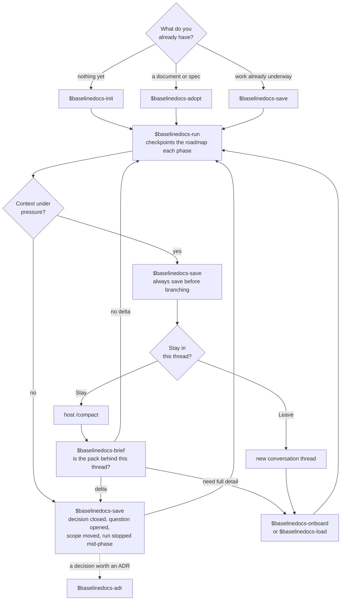

# Baseline Docs Guide

A pack is a small set of documents that carries a piece of work between conversations: `introduction` (scope and current truth), `roadmap` (phases and status), `hallucination` (decisions, open questions, rejected alternatives), and optionally `sourcecode` and `useguide`. These skills create, read, repair, and run packs.

## Skills the user calls

The user names these. Each one is explicit-only, so none fires on its own.

| Skill | Use it when | Result |
|---|---|---|
| `baselinedocs-init` | no pack exists and the work needs durable planning docs | first pack, or a multi-pack initiative |
| `baselinedocs-adopt` | a document, proposal, spec, wiki, or export already exists | converted into a traceable pack with nothing lost |
| `baselinedocs-save` | work is underway with no pack, or this thread established something the pack lacks | the pack written from the current thread |
| `baselinedocs-run` | a roadmap exists and should be executed | phases implemented, roadmap checkpointed after each, under the approval and commit policy the user picks |
| `baselinedocs-onboard` | starting work on an existing pack and wanting it fully read, with a report | every document read in full, then a five-section state report |
| `baselinedocs-load` | same as onboard, with no report | every document read in full, then a one-word confirmation |
| `baselinedocs-brief` | mid-task or after a compaction, wanting to know where work stands | position, blockers, and what the thread holds that the pack does not, without loading the pack |
| `baselinedocs-callout` | wanting a two-word name for a slice of the pack | a temporary named routing table inside `introduction` |
| `baselinedocs-adr` | a closed decision in `hallucination` deserves an Architectural Decision Record | one standalone ADR under `docs/adr/`, status Proposed |
| `baselinedocs-help` | asking what the skills do or which to use | this guide |
| `baselinedocs-self-upgrade` | the installed baselinedocs skills may be behind the latest release, in any agent on this machine | every installed copy compared with the latest tag, then upgraded after you confirm; no pack is touched |

## Skills the agent picks

An agent selects these when it notices the condition. The user may name one directly.

| Skill | Use it when | Result |
|---|---|---|
| `baselinedocs-sync-codebase` | code changed or a phase ended and documents may be stale | documents brought up to the code |
| `baselinedocs-sync-decisions` | a decision closed and has not reached every document it affects | the decision applied everywhere |
| `baselinedocs-sync-reconcile` | two documents disagree about current truth or status | the contradiction repaired |
| `baselinedocs-audit-drift` | unsure whether documents fell behind the code or a decision | ranked report, no writes |
| `baselinedocs-audit-claims` | unsure whether a statement in the pack is true | each claim marked verified, unverified, or contradicted, no writes |
| `baselinedocs-maintain-compact` | the pack is too noisy to resume from | shorter pack, same information |
| `baselinedocs-maintain-split` | one pack mixes workstreams | domain packs plus an initiative index |
| `baselinedocs-extract-wiki` | a reusable procedure is buried in a task-specific pack | a wiki article |
| `baselinedocs-recall` | after a compaction, before the next pack write or report | the contract and report style re-read, then a one-word confirmation |

## Workflow

`baselinedocs-save` before the branch is the step the rest rests on. Both branches lose the thread: staying keeps a lossy summary of it and leaving keeps none, so the pack is the only thing that survives either.

When a host cannot render the diagram, give the path in words: start with `init`, `adopt`, or `save`; then `run`; then `save` when a decision closed or scope moved; before a context branch always `save`, then either `/compact` followed by `brief`, or a new thread followed by `onboard` or `load`.

| Branch | Sources of truth afterwards | Choose it when |
|---|---|---|
| Stay in the thread | two: the pack, and a compaction summary that can disagree with it | the thread still holds something unwritable, a half-formed approach or a debugging session in flight |
| New thread | one: the pack | the pack is current, which after a save it is |

## Traps

| Trap | What is actually true |
|---|---|
| `brief` recovers detail | It is a diagnostic, not a restore. It reads frontmatter and the active roadmap sections and says so. It reports where work stands and whether the pack fell behind; `onboard` reads every document in full |
| `save` is the step after `run` | `run` already checkpoints the roadmap each phase. `save` owns what a checkpoint does not: decisions closed, questions opened, scope moved |
| one thing is called compact | Two are. Host `/compact` shrinks the conversation. `baselinedocs-maintain-compact` shrinks the pack, on a different axis: a pack gone noisy over months |
| `onboard` and `load` are the same | Both read the pack in full. `onboard` then reports its state; `load` confirms in one word and nothing else |
| an ADR is written into the pack | It is not. `baselinedocs-adr` reads a closed decision and writes a file under `docs/adr/`; recording that the ADR exists in the pack is `baselinedocs-save` |
| `self-upgrade` updates a pack | It does not. It upgrades the installed skills. Bringing a pack's documents up to the code is `baselinedocs-sync-codebase` |
